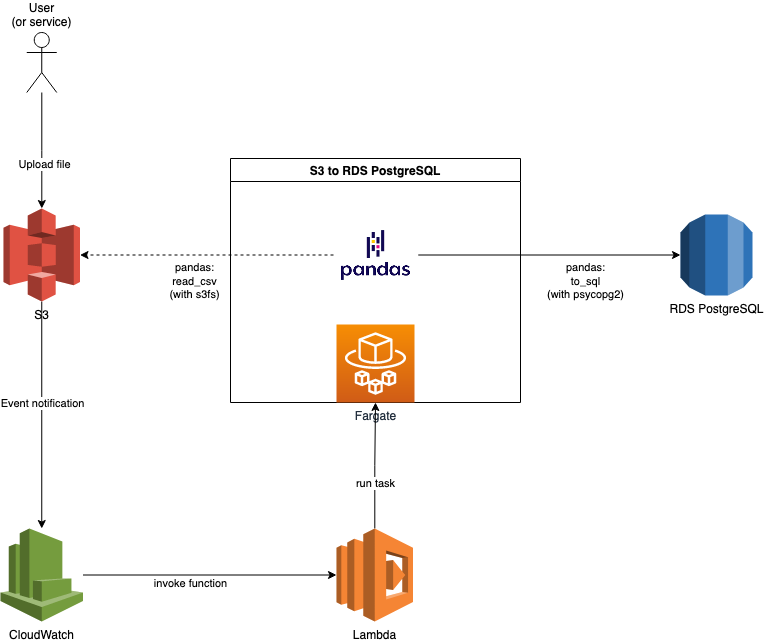
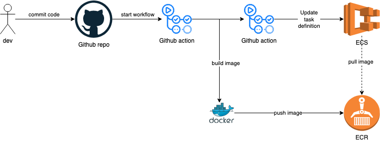
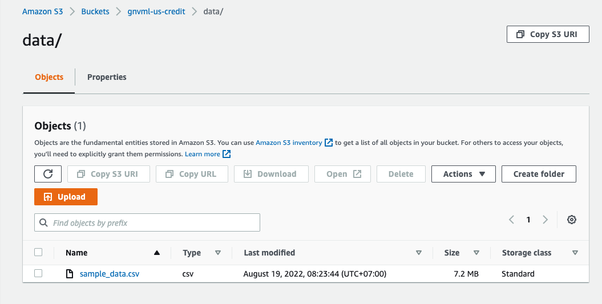
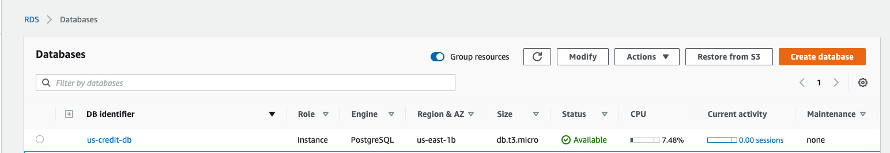
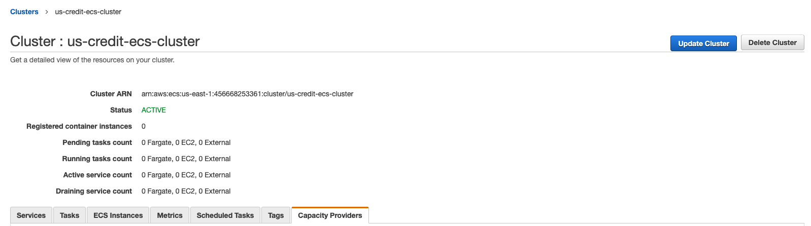
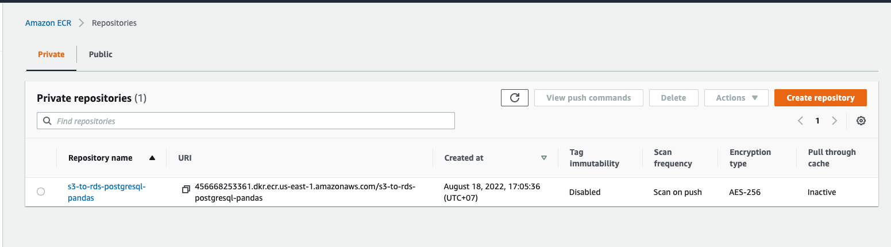
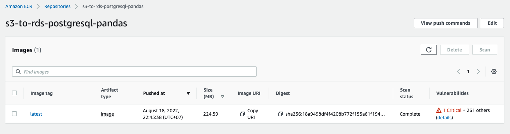
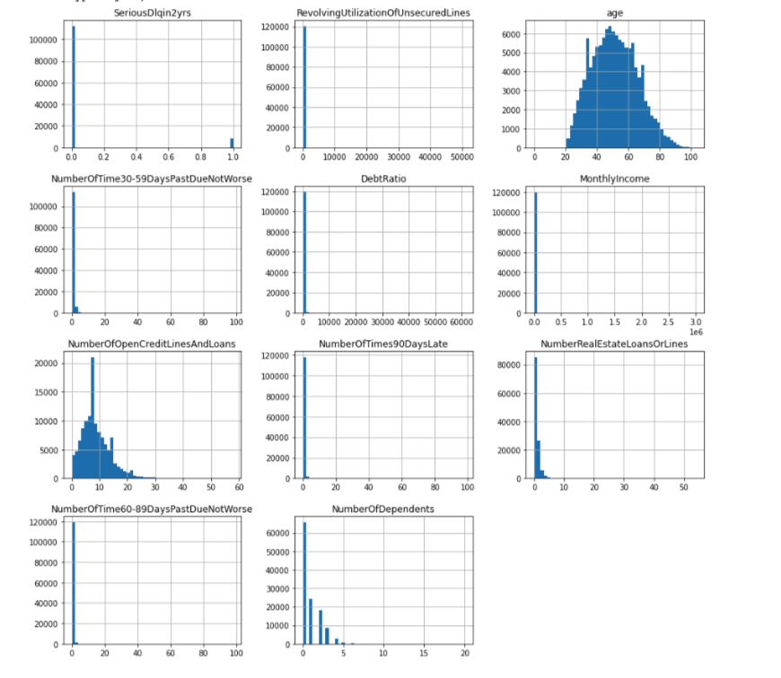
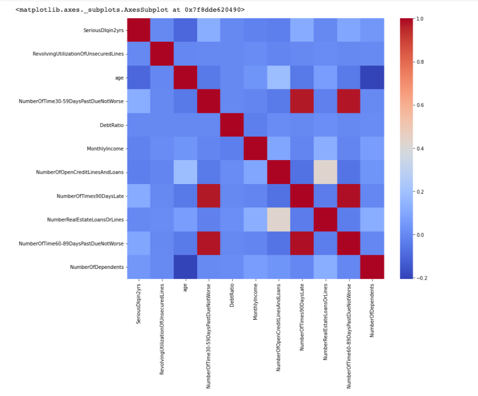
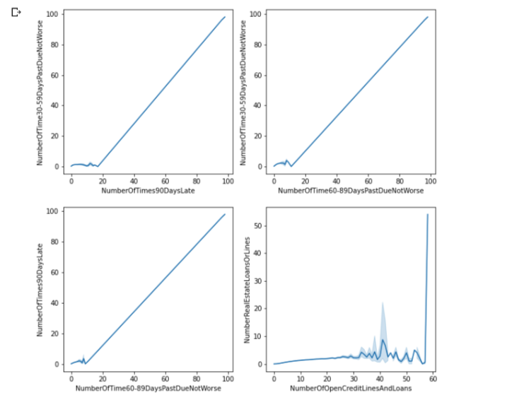

# Data Ingestion System in AWS

This repo contains an example Docker container that transfers data from S3 file(s) into a RDS PostgreSQL table by using Pandas and S3FS.

The goal of this example is to build a PoC for a data ingestion system to make incoming CSV data easy to use / query by our Data Scientists
# Part 1 - Data Ingestion

### In a nutshell, we will:

* Read contents of a CSV file from S3 with pandas and S3Fs
* Write this data to PostgreSQL with pandas and psycopg2

### A real-world scenario

We will try our solution in a real-world scenario with S3 Event Notifications, AWS Lambda and ECS-Fargate.
***



* The trigger will invoke the Lambda function every time a user/service adds an object to Amazon S3 bucket.
* The Lambda function will run Fargate according to uploaded file path.
* The Fargate task will transfer contents of the file to PostgreSQL table (on RDS).

### CICD Pipeline

Every good solution deserves a good CICD pipeline. For this solution we will build a CICD pipeline on top of Docker, Github Actions, ECR and ECS



### Create IAM users

IAM users arerequired to be able to create and manage AWS resources. You can externally research what IAM is and how users can be created in IAM.

So, you already have an IAM user (other than root user).
With it, we will first create a S3 bucket.

### Create S3 bucket
We can easily create our S3 bucket with the following command:

```
aws s3api create-bucket --bucket gnvml-us-credit --region us-east-1 --create-bucket-configuration LocationConstraint=us-east-1
```

You can easily upload your files to this bucket via cli, boto3 or console.

I have uploaded the sample file with below folder structure:




### Create PostgreSQL database on RDS

With this cli command, the PostgreSQL database will be created on RDS:

```
aws rds create-db-instance --db-instance-identifier us-credit-db \
 --db-instance-class db.t3.micro \
 —-engine postgres \
 —-storage-type gp2 \
 —-allocated-storage 20 \
 —-master-username {{master_username}} \
 —-master-user-password {{master_password}} \
 —-no-multi-az \
 —-vpc-security-group-ids {{security_group_id}} \
 —-no-publicly-accessible \
 —-engine-version 13.3

 ```

 
 
Now that our database is ready, we can try to connect. Make sure you already installed PostgreSQL
```
psql —-host=us-credit-db.ch6lnftk2ks9.us-east-1.rds.amazonaws.com —-port=5432 —-username={{master_username}} —-password —-dbname=postgres
```
### Python Script
Now that our table on RDS and files on S3 are ready, we can continue with the python script.

You can reach the whole script from [here](app.py).

There are two functions:

* s3_to_df : Reads data from S3 file to pandas DataFrame
* df_to_sql : Writes data from pandas DataFrame to PostgreSQL table
Since we are using pandas, we have a lot of configuration options while reading and writing (e.g. delimiter, chunksize etc. ).

### Containerize Project

In order to containerize the python script we need requirements.txt and Dockerfile files. You can reach all of these from below github repo.

At this point we can easily build our Docker image and even run it as a container.

```
docker build -t gnvml/s3-to-rds-postgresql-pandas .
```

As you can see in the python script there are 8 different parameters which comes from environment variables. We can pass these one by one or with an env file. (I prefer second one.)

Test local:
```
docker run --rm --env-file ./.env  -v$PWD:/app gnvml/s3-to-rds-postgresql-pandas
```

### Run Container-Task on AWS ECS

Create our ECS cluster via CLI:
```
aws ecs create-cluster —-cluster-name “us-credit-ecs-cluster”
```
 

 The ECR repository can be created the same way as well:

 ```
 aws ecr create-repository —-respository-name s3-to-rds-postgresql-pandas —-region us-east-1 —-image-scanning-configuration scanOnPush=true
 ```

  

Push docker image to ECR:

```
aws ecr get-login-password --region us-east-1 | docker login --username AWS --password-stdin 456668253361.dkr.ecr.us-east-1.amazonaws.com

docker tag gnvml/s3-to-rds-postgresql-pandas:latest 456668253361.dkr.ecr.us-east-1.amazonaws.com/s3-to-rds-postgresql-pandas:latest

docker push 456668253361.dkr.ecr.us-east-1.amazonaws.com/s3-to-rds-postgresql-pandas:latest
```

  

### Create Lambda function
* Inside Lambda page click “Create Function”
* Select “Use a blueprint”
* Select “s3-get-object-python” from Blueprints and click “configure”
* Enter a “Function name”
* Select/Create a role with permission to upload logs to Amazon CloudWatch Logs.
* Under S3 trigger; select your bucket, event type (PUT), prefix (e.g “./data”), suffix (e.g. “.csv.gz”)
* Click “Create Function”
With this configuration, wheneve a file is uploaded to our S3bucket, this function will be triggered.

In order to run Fargate task we need to manipulate code. After all, it will look like [this funtion](fargate_lambda_function.py)

### Create CICD pipeline

Inside .github/workflows/aws.yml there are seven steps:

* aws-actions/configure-aws-credentials@v1
* aws-actions/amazon-ecr-login@v1
* Build, tag, and push image to Amazon ECR (with new image ID)
* Download existing task definition from ECS
* Fill in the new image ID in the Amazon ECS task definition
* Register new task definition revision on ECS

# Part 2 - Understanding the Data
[This notebook](ETL_US_Credit.ipynb) implemented ETL process for the dataset from the [Give Me Some Credit](https://www.kaggle.com/c/GiveMeSomeCredit/overview) Kaggle competition. The data contains loan applicant information collected by a US credit bureau. Each row represents a single loan application and the information gathered on the applicant at the time of the application.

* [data_dictionary.md](data/data_dictionary.md) - A variable dictionary is provided with definitions for each variable.
* [sample_data.csv](data/sample_data.csv) - The dataset is provided to you in the form of a CSV file which can be found in this repository.

### Visualize the distribution of each feature in dataframe

### Visualize the correlation between all features



### Let's plot the correlation


### Install Postgresql

https://www.digitalocean.com/community/tutorials/how-to-install-postgresql-on-ubuntu-20-04-quickstart


### Install docker

https://docs.docker.com/engine/install/ubuntu/